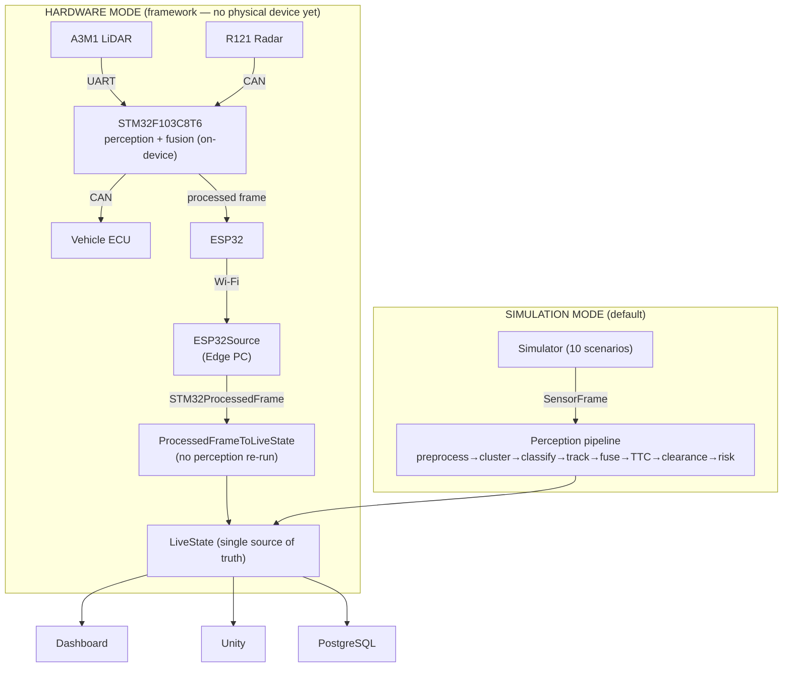
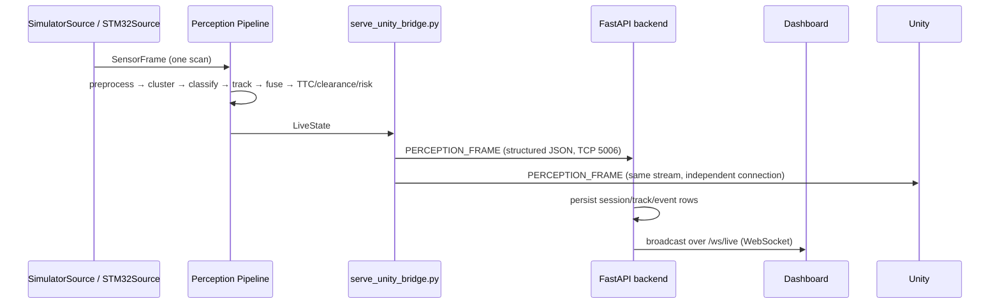

# LiDAR-Vision360

**Real-Time LiDAR–Radar Sensor Fusion and Edge-Based Object Detection, Tracking and Collision Risk
Assessment.**

Full specification: [PROJECT_SPECIFICATION.md](PROJECT_SPECIFICATION.md) (preserved as originally
written; this README tracks actual implementation status, per that document's own instruction).

> **Read this first:** the perception pipeline, tracking, TTC, clearance, risk, the sensor-fusion
> architecture, the STM32→ESP32→Edge hardware-input framework (`ESP32Source` + the Phase-2
> processed-perception contract), the STM32→ECU CAN-output software model, and the
> Dashboard/Unity/PostgreSQL flow are all implemented and tested — but **against simulation,
> mock-transport, and synthetic data only.** **No physical A3M1, R121, STM32, or ESP32 has been
> connected to this system, and no hardware/DBC specification has been supplied — so
> `DATA_SOURCE=hardware` cannot run against real hardware yet.** See
> [Two Modes](#two-modes-simulation-and-hardware), [Current Status](#current-status),
> [Limitations](#limitations), and `docs/hardware-validation-procedure.md`.

---

## Overview

LiDAR-Vision360 turns ~360 `(angle, distance)` measurements from a 2D 360° LiDAR — optionally
fused with radar target reports — into structured environmental understanding: obstacle
detection, classification, persistent tracking, time-to-collision, directional clearance, and an
overall risk assessment. Results are surfaced identically through a Unity digital twin, a
real-time web dashboard, and a PostgreSQL-backed event history.

The system is built **hardware-independent first**: every stage above is developed and validated
against a configurable 2D LiDAR simulator (10 scenarios) before any physical sensor is involved.
A parallel effort has since built the *framework* for the real hardware architecture — in which
the **STM32 is the primary perception node** (it runs preprocessing → fusion → detection →
tracking → TTC → clearance → risk itself) and the Edge PC receives **already-processed**
perception frames over **ESP32 → Wi-Fi** and only validates / monitors / visualises / stores
them. That framework (`ESP32Source`, the protocol-independent `STM32ProcessedFrame` contract, the
STM32→ECU CAN-output software model) has only ever been exercised with a mock transport and
synthetic frames. This distinction — **implemented & tested vs. physically validated** — is
maintained throughout.

## Objectives

Per [PROJECT_SPECIFICATION.md](PROJECT_SPECIFICATION.md) §3 ("Main Objectives"), plus the sensor
fusion work added since:

| Objective | Status |
|---|---|
| Simulated 360° LiDAR data generation | ✅ Implemented (`simulator/`, 10 scenarios) |
| Real LiDAR data integration via hardware adapter | 🔶 Framework implemented (`STM32Source` raw-serial adapter + `ESP32Source` processed-frame receiver); real protocol/hardware not yet connected |
| STM32 processed-perception data contract | ✅ Implemented (`models.stm32_processed.STM32ProcessedFrame`, versioned + validated) |
| ESP32 gateway (STM32 → ESP32 → Wi-Fi → Edge) | 🔶 `ESP32Source` + replaceable transport implemented & mock-tested; real Wi-Fi protocol pending |
| STM32 → Vehicle-ECU CAN output | 🔶 Configurable software model implemented & mock-tested (`can_output/`); no CAN/DBC spec, no bus |
| Preprocessing, noise/outlier filtering | ✅ Implemented |
| Polar → Cartesian conversion | ✅ Implemented |
| Obstacle clustering / segmentation | ✅ Implemented (DBSCAN) |
| Geometric feature extraction, shape-based classification | ✅ Implemented |
| Object IDs, tracking, velocity estimation | ✅ Implemented (nearest-neighbor + Kalman filter) |
| Occupancy grid mapping | ✅ Implemented |
| Collision-risk, TTC, low-clearance detection, safety zones | ✅ Implemented |
| Real-time Unity visualization / digital twin | ✅ Implemented |
| Cloud telemetry, real-time dashboard | ✅ Implemented (FastAPI + WebSocket + React) |
| Historical analytics | 🔶 Bounded event/session history in PostgreSQL; no analytics UI beyond the dashboard's own timeline |
| Safety alerts | 🔶 Risk/clearance levels are computed and surfaced; no separate alerting/notification channel |
| Radar integration / sensor fusion | 🔶 `FusionEngine` implemented and tested against synthetic `RadarReading` data (simulation mode); in hardware mode fusion runs **on the STM32** — no real R121 data processed either way |

## Key Features

- Deterministic, geometry-based perception — no deep learning in this prototype.
- One canonical `SensorFrame` abstraction consumed identically whether data comes from the
  simulator or (once configured) real STM32 hardware.
- LiDAR-only and LiDAR+Radar fusion modes, with radar strictly additive: a missing, stale, or
  implausible radar reading always falls back to the exact pre-fusion LiDAR-only behavior.
- Persistent object tracking with stable track IDs across frames, Kalman-filtered velocity.
- Time-to-Collision, directional clearance (front/rear/left/right), and an overall SAFE/WARNING/
  CRITICAL risk level, all recomputed every scan.
- One `LiveState` per scan is the single source of truth streamed to the dashboard, Unity, and
  persisted to PostgreSQL — none of them independently recompute detection/tracking/TTC/clearance/
  risk (see [Edge Computing Pipeline](#edge-computing-pipeline)).
- A hardware-integration framework (serial transport, configurable framing/CRC/sequence
  validation, reconnection, health tracking) ready to receive a real protocol once one exists,
  without guessing any of its actual values.
- 10 reproducible simulation scenarios exercising empty environments, static obstacles, moving
  obstacles, multi-object scenes, narrow corridors, sensor noise, and dropped measurements.

## System Architecture

The **final hardware architecture** and the **simulation architecture** converge on one
`LiveState`:



`STM32Source` (raw-serial adapter, runs the Edge pipeline) remains in the codebase and tested,
but the target hardware path is `ESP32Source` (processed frames, no Edge perception). See
[Two Modes](#two-modes-simulation-and-hardware).

The exact stage order (simulation) implemented in
`scripts/serve_unity_bridge.py` is: preprocessing → coordinate transform → clustering
(detection) → classification → tracking → **fusion** → collision/TTC + clearance → risk →
`LiveState`. `FusionEngine` runs on the already-tracked LiDAR objects (enriching them with any
matched radar target) rather than before detection — see [Sensor Fusion](#sensor-fusion) and
[docs/fusion.md](docs/fusion.md) for why, and why it makes no difference to what reaches
`LiveState`/Dashboard/Unity/PostgreSQL.

### Important architecture rule

**The Edge processing layer (`perception/`, driven by `scripts/serve_unity_bridge.py`) is the
single source of truth for processed perception results.** The Dashboard and Unity both consume
the identical `LiveState`/`PERCEPTION_FRAME` stream over their own independent connections; neither
independently recomputes detection, classification, tracking, TTC, clearance, or risk. See
[docs/communication.md](docs/communication.md) and [docs/architecture.md](docs/architecture.md).

## Two Modes: Simulation and Hardware

`Settings.data_source` (`LIDAR_DATA_SOURCE`) selects the mode. Both converge on one `LiveState`;
the Dashboard, Unity, and PostgreSQL are identical in both.

| | **Simulation** (`data_source=simulation`, default) | **Hardware** (`data_source=hardware`) |
|---|---|---|
| Source | `simulator.SimulatorSource` (10 scenarios) | `datasources.esp32.ESP32Source` — receives `STM32ProcessedFrame`s over a replaceable `ESP32Transport` |
| Perception | runs on the Edge (`serve_unity_bridge.py`: preprocess→…→risk) | runs **on the STM32**; the Edge only re-shapes the processed frame into `LiveState` (`ProcessedFrameToLiveState`), never re-detects/tracks/scores |
| Transport | in-process | `LIDAR_ESP32_TRANSPORT`: unset → `connect()` fails loudly (**never** falls back to simulation); `mock` → scripted SIMULATED ESP32 transport; a real name needs a `ProcessedFrameDeserializer`/`ESP32Transport` subclass |
| No data | n/a | Edge → `STALE` / `RECONNECTING`; wire `HARDWARE_DATA_UNAVAILABLE`; Dashboard banner; **no synthetic fallback** |
| CAN → ECU | n/a | `can_output` software model (opt-in, `LIDAR_CAN_OUTPUT_ENABLED=true`), independent of the ESP32 path |

The **10 simulation scenarios are permanent** and are the software regression suite. See
`docs/esp32-integration.md`, `docs/can-output.md`, `docs/stm32-processed-contract.md`.

## Hardware

| Component | Model | Interface | Status in this repository |
|---|---|---|---|
| LiDAR | SLAMTEC RPLIDAR A3M1 | UART → STM32 | Named in the target architecture; **no physical unit connected; UART/framing/scaling spec not supplied** |
| Radar | R121 Radar Module | CAN → STM32 | Named in the target architecture; **no physical unit connected; CAN IDs / DLC / layout not supplied** |
| MCU | STM32F103C8T6 | UART in (A3M1), CAN in (R121), CAN out (ECU), processed-frame out (ESP32) | **Primary perception node in hardware mode.** No firmware in this repo (`embedded/stm32/` is a README). Edge-side seams complete (`datasources.stm32`, `models.stm32_processed`, `can_output`) |
| Gateway | ESP32 | STM32 ↔ Wi-Fi | Treated as a transparent gateway. `ESP32Source` + replaceable `ESP32Transport` implemented; **real Wi-Fi transport/host/port/encoding not supplied** |
| ECU | Vehicle ECU | CAN from STM32 | `can_output` software model (configurable message/signal specs, DBC-style bit-packer, mock transports); **no bitrate / CAN IDs / DLC / DBC supplied, no bus** |
| Edge computer | Any machine running `perception/` + `cloud/` | Wi-Fi from ESP32 | Ready to configure once the specs exist |

See [Two Modes](#two-modes-simulation-and-hardware), `docs/hardware-integration.md`,
`docs/esp32-integration.md`, `docs/can-output.md`, `docs/stm32-processed-contract.md`, and the
step-by-step `docs/hardware-validation-procedure.md`. The complete Edge software path can be run
today with **no devices** via the scripted MOCK STM32 HARDWARE OUTPUT
(`LIDAR_ESP32_TRANSPORT=mock`, `LIDAR_ESP32_MOCK_SCENARIO=realtime_arc|multi_object|tracking`) —
see `docs/mock-stm32-hardware-output.md`.

## Software Stack

| Layer | Technology |
|---|---|
| Perception engine | Python 3.10+, NumPy, scikit-learn (DBSCAN), Pydantic / pydantic-settings |
| Simulator | Python, ray-casting 2D LiDAR model, configurable scenario JSON |
| STM32 raw-serial transport | `pyserial` (`datasources.stm32.transport.SerialTransport`) |
| STM32 processed-frame contract | `models.stm32_processed.STM32ProcessedFrame` (versioned, validated) + `datasources.stm32.processed` (deserializer interface + JSON reference codec) |
| ESP32 gateway | `datasources.esp32` — `ESP32Source`, replaceable `ESP32Transport` (mock / scripted), `ProcessedFrameToLiveState` adapter |
| STM32 → ECU CAN output | `can_output` — configurable `CANMessageSpec`/`CANSignalSpec`, `SignalPacker` (DBC-style), `MockCANTransport` / `LoggingCANTransport` |
| Streaming (Edge → consumers) | Raw TCP (legacy `<START>`/`<END>` protocol), structured JSON TCP, over `perception/src/streaming/` |
| Backend | FastAPI, Uvicorn, SQLAlchemy, native WebSockets |
| Database | PostgreSQL, with automatic local SQLite fallback if unreachable |
| Dashboard | React, TypeScript, Vite, Vitest |
| Digital twin | Unity (C#) |
| Testing | pytest (`perception/`, `simulator/`, `cloud/backend/`), Vitest (`cloud/dashboard/`) |

## Data Flow



Unity and the backend are both direct, independent TCP clients of the same bridge process — the
bridge does not relay through the backend, and the backend does not relay through Unity. See
[docs/communication.md](docs/communication.md).

## Edge Computing Pipeline

`scripts/serve_unity_bridge.py` dispatches on `Settings.data_source`. In **hardware mode** it runs
`datasources.esp32.edge_runner.run_esp32_edge` — `ESP32Source.poll()` → `ProcessedFrameToLiveState`
(reshape only) → publish; **no pipeline stages below run** (the STM32 already did the perception).
In **simulation mode** it selects a `SensorSource` (`scripts/sensor_source.py`) and, for every
scan, runs in order:

1. `preprocessing.Preprocessor` — validation, range filtering, outlier/noise filtering
2. `coordinates.CoordinateTransformer` — polar → Cartesian
3. `clustering.DBSCANClusterer` — obstacle clustering (object detection)
4. `objects.GeometricClassifier` — shape-based classification
5. `tracking.ObjectTracker` — nearest-neighbor association + Kalman filter, persistent track IDs
6. `fusion.FusionEngine` — merges in any available `RadarReading` (see [Sensor Fusion](#sensor-fusion))
7. `collision.CollisionRiskEngine` — TTC, footprint-intersection prediction, risk level
8. `clearance.ClearanceEngine` — directional clearance (front/rear/left/right)
9. `mapping.OccupancyGridMapper` — 2D log-odds occupancy grid (runs in parallel off the Cartesian scan)
10. `pipeline.LiveStateBuilder` — assembles the single `LiveState` for this scan, records events

The resulting `LiveState`/`PERCEPTION_FRAME` is published over the streaming servers
(`perception/src/streaming/`) for Unity and the backend to consume independently.

## SensorFrame Architecture

`SensorFrame` (`perception/src/datasources/base.py`) is a plain alias of `models.scan.ScanFrame` —
not a parallel schema. Every `SensorSource` (`SimulatorSource`, `STM32Source`) implements the same
`connect()` / `disconnect()` / `read_scan() -> SensorFrame` / `is_connected()` interface, so the
rest of the pipeline never knows or cares whether a scan came from the simulator or real hardware.

```python
class LiDARDataSource(ABC):   # == SensorSource
    def connect(self) -> None: ...
    def disconnect(self) -> None: ...
    def read_scan(self) -> ScanFrame: ...   # == SensorFrame
    def is_connected(self) -> bool: ...
```

`scripts/sensor_source.py::get_sensor_source()` picks `SimulatorSource` for
`data_source="simulation"`. For `data_source="hardware"` the bridge instead uses
`datasources.esp32.ESP32Source`, which does **not** produce a raw `ScanFrame` — it delivers an
already-processed `models.stm32_processed.STM32ProcessedFrame` (see
[docs/stm32-processed-contract.md](docs/stm32-processed-contract.md) and
[docs/esp32-integration.md](docs/esp32-integration.md)). The legacy `STM32Source` (raw serial,
runs the Edge pipeline) remains selectable/tested but is not the target hardware path.

## LiDAR Processing

`preprocessing.Preprocessor` validates each measurement (range, finiteness, sensor-flagged
invalidity), filters isolated-spike outliers and reduces noise over a configurable window, and
optionally applies exponential temporal smoothing. `coordinates.CoordinateTransformer` then
converts every valid polar `(angle, distance)` point to Cartesian `(x, y)`. See
[docs/preprocessing.md](docs/preprocessing.md) and [docs/coordinates.md](docs/coordinates.md).

## Radar Processing

`models/radar.py` defines a protocol-independent `RadarTarget` (`range_m`, and *optionally*
`angle_deg`, `velocity_mps`, `confidence`, `target_id` — populated only when a real parser
actually provides them) and `RadarReading` (a source/session/timestamp-tagged list of targets).
No R121 CAN ID, DLC, byte layout, or scaling factor is referenced anywhere in `models/radar.py`,
`fusion/`, or `datasources/stm32/parsers.py`'s `RadarMessageParser` interface — that mapping does
not exist yet (see [Hardware Integration](#hardware-integration)). `STM32Source` exposes the most
recent parsed reading as `latest_radar_reading`, which stays `None` until a real parser is
supplied.

## Sensor Fusion

`fusion.FusionEngine.fuse(tracked_scan, radar_reading) -> TrackedScan` — same type in, same type
out, so nothing downstream needs to know fusion happened. Implemented behavior:

- **No radar reading available, fusion disabled, a stale timestamp (outside
  `fusion_max_timestamp_diff_s`), or every target failing plausibility checks** → the input
  `TrackedScan` is returned completely untouched (LiDAR-only mode).
- **A radar target spatially and range-gated close enough to a tracked LiDAR object**
  (`fusion_association_max_distance_m` / `fusion_association_max_range_diff_m`, greedy
  nearest-neighbor, one-to-one) → merged into that ONE object (never duplicated): its
  `sensor_sources` gains `"radar"`, `radar_target_id`/`radar_confidence`/`radar_range_m` are
  populated, and its velocity's radial component is replaced by the radar's (typically more
  accurate) range-rate while the LiDAR-derived tangential component is preserved.
- **An unmatched radar target with a resolvable angle** → becomes its own object
  (`classification=UNKNOWN`, no shape data — radar alone provides neither); its track ID is
  stable across frames only if the radar itself reports a stable `target_id`.
- **An unmatched LiDAR object** → passes through untouched.

`FusionEngine` never raises for bad radar input — invalid data is excluded, never allowed to
corrupt the LiDAR-derived result. Full design rationale: [docs/fusion.md](docs/fusion.md).

## Object Detection and Classification

Obstacle clustering (`clustering.DBSCANClusterer`) groups Cartesian points into obstacle clusters,
handling the 0°/360° angular boundary correctly. `objects.GeometricClassifier` then assigns each
cluster a shape class — `WALL`, `VEHICLE_LIKE`, `POLE_LIKE`, `PERSON_LIKE`, `LARGE_OBSTACLE`, or
`UNKNOWN` — from geometric features (aspect ratio, linearity/circularity fit, point density,
angular width), with a human-readable explanation for every classification. This is rule-based
shape classification, not general-purpose object recognition. See
[docs/clustering.md](docs/clustering.md) and
[docs/object-classification.md](docs/object-classification.md).

## Object Tracking

`tracking.ObjectTracker` associates each scan's detections with existing tracks (nearest-neighbor)
and maintains a Kalman filter per track for position/velocity estimation. Tracks move through a
`TENTATIVE → CONFIRMED → COASTING → LOST` lifecycle; every live track keeps a stable `track_id`
across frames until it is lost. See [docs/tracking.md](docs/tracking.md).

## TTC and Clearance

`collision.CollisionRiskEngine` computes Time-to-Collision per object (accounting for the vehicle's
own footprint and motion), whether the object is in the vehicle's projected path, and a predicted
collision time/position. `clearance.ClearanceEngine` independently computes directional clearance
(front/rear/left/right distances, minimum clearance, corridor width) with its own
SAFE/CAUTION/LOW_CLEARANCE/CRITICAL status. See [docs/collision.md](docs/collision.md).

## Collision Risk Assessment

Per-object risk levels (SAFE/WARNING/CRITICAL) combine path membership, distance, TTC, and closing
speed, with hysteresis so a track's reported risk level doesn't flicker across a threshold on
sensor noise alone. An overall scan-level risk is the most severe among all tracked objects. See
[docs/collision.md](docs/collision.md).

## Real-Time Dashboard

`cloud/backend` (FastAPI) ingests the same structured stream Unity consumes, persists
sessions/tracks/events, and serves REST + a `/ws/live` WebSocket. `cloud/dashboard` (React +
TypeScript + Vite) renders system status, live object/track tables, the safety panel (risk,
clearance, TTC), an environment map, and an event timeline — all driven by that one WebSocket feed
plus REST calls, never by recomputing perception itself. See [docs/cloud.md](docs/cloud.md).

## Unity Visualization

`unity/LiDARVision360` is a direct TCP client of the same structured JSON stream the backend
consumes (`PerceptionTCPClient.cs`, port 5006) — it renders the same tracked objects, risk, and
clearance the dashboard shows, not a separately-computed view. See [docs/unity.md](docs/unity.md).

## PostgreSQL

`cloud/backend` persists sessions, track lifecycle records, and collision/clearance/TTC/sensor
events to PostgreSQL via SQLAlchemy. If the configured PostgreSQL instance is unreachable at
startup (e.g. no local server), the backend automatically falls back to a local SQLite file
(`cloud/backend/data/lidar_vision360.db`, gitignored) and logs a warning — this is existing,
intentional local-development behavior, not new to this README update. See
[docs/cloud.md](docs/cloud.md) "Database".

## Simulation Scenarios

All 10 live under `simulator/scenarios/*.json` and are runnable via `python -m simulator.cli` or
the full demo stack. What each one validates:

| Scenario | What it validates |
|---|---|
| `01_empty` | No obstacles anywhere — every ray reports max range; baseline "nothing to detect" behavior. |
| `02_wall_in_front` | A long straight wall 5 m directly ahead — basic detection/classification of a flat surface. |
| `03_pole_left` | A thin pole 3 m to the left — detection/classification of a small, narrow object off-axis. |
| `04_vehicle_ahead` | A car-sized rectangular obstacle 6 m ahead — vehicle-shaped classification and clearance from a compact obstacle. |
| `05_multiple_obstacles` | A wall, a pole, and a vehicle-like rectangle simultaneously — multi-object detection, classification, and independent tracking. |
| `06_narrow_corridor` | Two parallel walls 2.0 m apart (tighter than vehicle width + margin) — directional clearance and low-clearance/critical detection. |
| `07_moving_crossing` | A pole moving laterally at 1.5 m/s across the vehicle's path — tracking a moving, non-head-on object; classification under high relative motion. |
| `08_approaching_obstacle` | A vehicle-like rectangle approaching head-on at 2.0 m/s — TTC decay, clearance/risk escalation (this project's primary collision-risk demo scenario). |
| `09_noisy_lidar` | Scenario 02's geometry with elevated Gaussian distance noise — pipeline robustness to noisy measurements. |
| `10_missing_outliers` | Scenario 02's geometry with elevated missing-measurement and outlier probability — preprocessing's outlier/dropout handling. |

## Project Structure

```
LiDAR-Vision360/
├── perception/                 Python perception engine (installable package, src-layout)
│   ├── src/
│   │   ├── common/             Settings (pydantic-settings), logging
│   │   ├── models/             Canonical data models (LiDARPoint, ScanFrame, DetectedObject,
│   │   │                       TrackedScan, RadarReading, LiveState, ...)
│   │   ├── preprocessing/      Validation, outlier/noise filtering, temporal smoothing
│   │   ├── coordinates/        Polar → Cartesian transformation
│   │   ├── clustering/         DBSCAN obstacle clustering
│   │   ├── objects/            Geometric shape classification
│   │   ├── tracking/           Nearest-neighbor + Kalman filter tracking, track history
│   │   ├── mapping/            2D occupancy grid mapping
│   │   ├── collision/          Collision-risk engine (TTC, prediction, risk)
│   │   ├── clearance/          Directional clearance engine
│   │   ├── fusion/             Sensor fusion (FusionEngine, association, validation) — simulation mode
│   │   ├── models/stm32_processed.py   STM32ProcessedFrame contract (Phase 2)
│   │   ├── can_output/         STM32→ECU CAN-output software model (specs, encoder, transports, controller)
│   │   ├── datasources/        SensorSource abstraction, SimulatedLiDARDataSource,
│   │   │   ├── stm32/          legacy raw-serial STM32Source (transport, framing, CRC, sequence, health, parsers)
│   │   │   │   └── processed/  STM32ProcessedFrame version gate + validation + serializer interface
│   │   │   └── esp32/          ESP32Source, replaceable ESP32Transport, ProcessedFrameToLiveState, edge_runner
│   │   ├── pipeline/           LiveState assembly (LiveStateBuilder)
│   │   ├── serialization/      Unity/dashboard wire-format message builders
│   │   └── streaming/          TCP servers (raw + structured JSON), bounded outgoing queues
│   └── tests/                  ~1056 tests (pytest)
├── simulator/                  Configurable 2D 360° LiDAR simulator
│   ├── scenarios/               10 predefined scenario JSON files
│   ├── src/simulator/          Ray-casting model, obstacles, noise, CLI, recording/replay
│   └── tests/                  ~243 tests
├── cloud/
│   ├── backend/                 FastAPI backend (REST + WebSocket + PostgreSQL/SQLite)
│   │   └── src/backend/routes/ core.py, debug.py, events.py, frames.py, metrics.py
│   └── dashboard/               React + TypeScript + Vite dashboard (~53 Vitest)
├── unity/LiDARVision360/        Unity digital twin project
├── embedded/stm32/              STM32 firmware (README only — not in this repo; awaiting spec)
├── docker/                      Containerization (README only; no Dockerfile yet)
├── docs/                        Per-subsystem architecture/design docs
├── scripts/                     Setup, demo launch/stop, benchmarks, visualizers, verification
├── PROJECT_SPECIFICATION.md     Canonical original specification
└── README.md                    This file
```

## Installation

Requires Python 3.10+ and Node.js (for the dashboard). Commands below are what this repository's
own `scripts/setup_env.ps1` / `scripts/setup_env.sh` run, plus the backend/dashboard steps those
scripts don't currently cover.

**1. Python environment:**

```bash
python -m venv .venv
```
```bash
# Windows PowerShell
.venv\Scripts\Activate.ps1
# macOS/Linux
source .venv/bin/activate
```

**2. Perception + simulator (editable, with test dependencies):**

```bash
pip install -e "./perception[dev]"
pip install -e "./simulator[dev,viz]"
```

**3. Cloud backend** (not installed by `setup_env.*` — install it the same way):

```bash
pip install -e "./cloud/backend[dev]"
```

**4. Dashboard (frontend) dependencies:**

```bash
cd cloud/dashboard
npm install
```

**5. Environment file** (optional — every setting has a working default):

```bash
cp .env.example .env
```

`scripts/setup_env.ps1` (Windows) / `scripts/setup_env.sh` (macOS/Linux) automate steps 1-2 and 5.

## Configuration

All settings are environment variables prefixed `LIDAR_`, read by
`perception/src/common/config.py` (pydantic-settings) — `cloud/backend` reuses the same `Settings`
class. See [.env.example](.env.example) for the full, documented list. Key groups:

| Group | Examples |
|---|---|
| LiDAR / vehicle | `LIDAR_LIDAR_RANGE_MAX_M`, `LIDAR_VEHICLE_WIDTH_M`, `LIDAR_VEHICLE_LENGTH_M` |
| Backend / database | `LIDAR_BACKEND_PORT`, `LIDAR_DATABASE_URL` |
| Sensor source selection | `LIDAR_DATA_SOURCE=simulation` \| `hardware` |
| STM32 hardware protocol | `LIDAR_STM32_UART_PORT`, `LIDAR_STM32_UART_BAUDRATE`, plus framing/byte-order/CRC/message-type/scaling/timestamp fields — all unset by default; see [Hardware Integration](#hardware-integration) |
| Sensor fusion | `fusion_enabled`, `fusion_association_max_distance_m`, `fusion_association_max_range_diff_m`, `fusion_max_timestamp_diff_s`, `fusion_max_valid_range_m`, `fusion_max_valid_velocity_mps` (defined in `common/config.py`; not yet mirrored in `.env.example`) |

`LIDAR_DATA_SOURCE=hardware` selects `STM32Source`, but its `connect()` deliberately raises
`STM32ConfigurationError` until every required protocol field above is set to a real value from
the hardware team's specification — it never falls back to simulated data.

## Running the Project

One command starts the whole simulation stack (perception bridge + FastAPI backend + React
dashboard), each in its own window, with process-identity-based startup/shutdown and end-to-end
verification:

```powershell
.\scripts\run_demo.ps1 -Scenario 08_approaching_obstacle -Rate 10
```

Then open `http://localhost:5173`. Unity connects to the same `127.0.0.1:5006` independently (open
`unity/LiDARVision360` in the Editor, set `LidarInputManager.mode = StructuredJsonTcp`, press
Play).

```powershell
.\scripts\stop_demo.ps1
```

To run each piece by hand instead (three terminals):

```powershell
python scripts/serve_unity_bridge.py --scenario 08_approaching_obstacle --vehicle-speed 0 --rate 10
```
```powershell
uvicorn backend.main:app --app-dir cloud/backend/src --host 0.0.0.0 --port 8000
```
```powershell
cd cloud/dashboard; npm run dev
```

**Mock-hardware mode** — the full hardware code path (`ESP32Source` → `STM32ProcessedFrame` →
`LiveState`) driven by a scripted SIMULATED ESP32 transport. No physical device; clearly labelled
in the logs. Optionally also runs the STM32→ECU CAN-output software model.

```powershell
$env:LIDAR_DATA_SOURCE = "hardware"; $env:LIDAR_ESP32_TRANSPORT = "mock"
# optional: $env:LIDAR_CAN_OUTPUT_ENABLED = "true"
python scripts/serve_unity_bridge.py --rate 10
```

**Real hardware mode** — same command with `LIDAR_ESP32_TRANSPORT` set to a real transport name
and `LIDAR_ESP32_HOST` / `LIDAR_ESP32_PORT` from the hardware spec (plus the `.env` fields listed
in `docs/hardware-validation-procedure.md`). With `LIDAR_ESP32_TRANSPORT` unset it exits **2**
with *"NEVER falls back to simulation data"* — by design, it never silently substitutes simulated
data. See [Hardware Integration](#hardware-integration) and `docs/final-demonstration.md`.

## Running Individual Scenarios

```powershell
.\scripts\run_demo.ps1 -Scenario 01_empty
```
```powershell
.\scripts\run_demo.ps1 -Scenario 05_multiple_obstacles
```
```powershell
.\scripts\run_demo.ps1 -Scenario 08_approaching_obstacle -Rate 10
```

Or directly against the simulator, without the backend/dashboard:

```powershell
python -m simulator.cli list
python -m simulator.cli run --scenario 05_multiple_obstacles --scans 5
```

## Debugging Endpoints

Served by `cloud/backend`, at both a bare path and an `/api/`-prefixed path (e.g. `/health` and
`/api/health` are the same endpoint):

| Endpoint | Purpose |
|---|---|
| `GET /health` | Backend liveness/uptime. |
| `GET /status` | Connection state to the perception bridge, session info, measured scan rate. |
| `GET /debug/live-frame` | The current live perception frame (objects, tracks, risk, clearance) — `null` if not connected. |
| `GET /debug/stream-status` | Denser single-call summary: connected, frame age, risk, object/track counts, latency, measured scan rate, and `last_error_code`/`last_error_message` (e.g. `HARDWARE_DATA_UNAVAILABLE` + reason, cleared on the next real frame). |
| `GET /latest`, `/objects`, `/tracks`, `/tracks/{track_id}` | Current-scan snapshots. |
| `GET /events`, `/collision-events`, `/clearance-events`, `/ttc-events`, `/sensor-events` | DB-persisted event history, session-scoped by default. |
| `GET /sessions`, `/sessions/{id}` | Session records. |
| `GET /metrics` | Backend metrics. |
| `WS /ws/live` | Real-time WebSocket feed the dashboard consumes. |

## Testing

```bash
pytest perception/tests -q      # run separately -- perception/ and simulator/ both define a `tests` package
pytest simulator/tests -q
pytest cloud/backend/tests/test_state.py cloud/backend/tests/test_ingestion.py -q
```
```bash
cd cloud/dashboard
npx tsc --noEmit && npm test
```

**Verified results — run against simulation, mock-transport, and synthetic data only; NOT
hardware validation.** Results are kept in four never-combined categories:

| Category | Suite | Result |
|---|---|---|
| **SOFTWARE UNIT** | `perception/tests` | **1056 passed** (incl. `test_stm32_processed_contract` 61, `test_esp32_*` 70, `test_can_output_*` 73, fusion 39) |
| **SOFTWARE UNIT** | `simulator/tests` | **243 passed**, 1 pre-existing flaky (`TestPole::test_pole_classifies_as_pole_like` — noise-driven, ~11/12 on a clean checkout) |
| **SOFTWARE UNIT** | `cloud/backend` (`test_state.py` + `test_ingestion.py`) | **41 passed** (`test_api.py` = pre-existing hang, not run) |
| **SOFTWARE UNIT** | `cloud/dashboard` (`tsc` + Vitest) | **exit 0**, **53 passed** |
| **SIMULATION** | all 10 scenarios, backend + bridge, live `/debug/*` sampling | **10/10 verified** (see [Current Status](#current-status)) |
| **MOCK HARDWARE** | `DATA_SOURCE=hardware` + `ESP32_TRANSPORT=mock`, backend + bridge + WebSocket + DB + failure injection | **pass** |
| **PHYSICAL HARDWARE** | — | **NOT PERFORMED — no device / no spec** |

## Hardware Integration

**Implemented (software seams, all mock/unit-tested — no physical device):**

- `datasources.stm32.processed` — the protocol-independent `STM32ProcessedFrame` contract
  (Phase 2): versioned (`SUPPORTED_MAJOR_VERSIONS`), semantically validated
  (`validate_processed_frame`), with a replaceable `ProcessedFrameDeserializer` interface and a
  JSON reference codec.
- `datasources.esp32` — `ESP32Source` (connection mgmt, timeout, reconnect-with-backoff,
  heartbeat, stale-frame detection, sequence-gap / dropped-frame tracking, malformed rejection,
  **no synthetic fallback**), a replaceable `ESP32Transport` (mock / scripted), and
  `ProcessedFrameToLiveState` (reshapes a processed frame into `LiveState` — reusing
  `LiveStateBuilder`, running **no** perception).
- `can_output` — configurable `CANMessageSpec` / `CANSignalSpec` / `CANOutputConfig`, a
  standard DBC-style `SignalPacker`, per-signal validation, transmission control (periodic +
  event, rate-capped, sequenced), bus-off / tx-failure / queue-overflow handling + recovery +
  `CANOutputHealth`, and `MockCANTransport` / `LoggingCANTransport`. Independent of `datasources.esp32`.
- `datasources.stm32` (legacy raw-serial path) — `STM32Source`, `SerialTransport`,
  `STM32ConnectionManager`, `FrameCodec`, `crc` (`none`/`xor8`/`sum8`/`crc8`/`crc16_ccitt`),
  `SequenceValidator`, `HealthMonitor`, `LiDARMessageParser`/`RadarMessageParser` (shipped
  defaults always raise rather than guess). Retained and tested; not the target hardware path.

**Pending real hardware validation** (full per-field list + config mapping in
[docs/hardware-validation-procedure.md](docs/hardware-validation-procedure.md); see also
[docs/hardware-integration.md](docs/hardware-integration.md),
[docs/esp32-integration.md](docs/esp32-integration.md), [docs/can-output.md](docs/can-output.md)):

- Physical A3M1 + R121 + STM32 (with firmware) + ESP32 + Vehicle ECU, wired and networked.
- A3M1→STM32 UART: baud, framing, byte order, message-type/sequence/CRC fields, payload
  offsets/widths/scaling, quality field, timestamp format — plus a real `LiDARMessageParser`.
- R121→STM32 CAN: CAN ID(s), DLC, byte layout, scaling — plus a real `RadarMessageParser`.
- STM32↔ESP32↔Edge: transport, host/port, framing, encoding, CRC, auth — plus (if non-JSON) a
  real `ProcessedFrameDeserializer` and an `ESP32Transport` subclass.
- STM32→ECU CAN: bitrate, interface, per-message CAN ID/DLC/period, per-signal
  layout/scaling/sign, checksum — plus a real `CANTransport` (`python-can` is not a dependency).

**No baud rate, CAN ID, CAN bitrate, DLC, byte layout, scaling factor, CRC parameter, ESP32
IP/port, or sensor measurement in this repository is invented** — every hardware-specific value
is a documented placeholder (`None`) reported by `pending_hardware_parameters()` / the
`STM32ConfigurationError` / `ESP32ConfigurationError` gates, or absent pending the real spec.

## Current Status

**Software & simulation: complete and verified.** The full perception pipeline, the STM32
processed-perception contract, `ESP32Source`, the CAN-output model, Dashboard, Unity, and
PostgreSQL persistence all work end-to-end. ~1393 software unit tests pass (see
[Testing](#testing)).

**Simulation end-to-end (measured, live backend + bridge, all 10 scenarios):** correct
object/track counts (`01_empty` → 0/0/SAFE; `05_multiple_obstacles` → 5 objects, 5 distinct track
IDs, CRITICAL; `04_vehicle_ahead` → vehicle_like, LOW_CLEARANCE 0.48 m), real velocities
(`07_moving_crossing` ≈ 1.5 m/s), TTC finite where closing and absent otherwise
(`08_approaching_obstacle` TTC 1.38 → 0.38 → 0.0 s while distance shrinks and risk escalates to
CRITICAL), directional clearance from the clearance engine, **~9.96 Hz (target 10), 0 dropped
frames**, wire latency ≈ 3.7 ms mean, sensor-ingestion latency ≈ 64 ms mean.
`GET /debug/live-frame` matches `GET /debug/stream-status`.

**Mock hardware end-to-end (SIMULATED ESP32 transport):** `source_id = stm32_hardware`,
`config.data_source = hardware`, monotonic sequence, `sensor_source = lidar+radar`, risk
`SAFE → WARNING → CRITICAL` and TTC `6.1 → 0.25 s` as the scripted vehicle approaches, ~9.9 Hz,
0 dropped, ingestion latency ≈ 8 ms mean. On link loss: Edge → `STALE`/`RECONNECTING`,
`/debug/live-frame` → `null` (**not** a stale frame), `HARDWARE_DATA_UNAVAILABLE` on the wire,
**no simulation fallback**. `DATA_SOURCE=hardware` with no transport → **exit 2**.

**PostgreSQL:** a mock-hardware session persists a `sessions` row (`source_id=stm32_hardware`,
`edge_session_id`, `frame_count`, `status=ended`), one `tracks` row per `track_id` (verified: 1
row / 1 distinct id, `sensor_source=lidar+radar`), and one event row per risk/clearance
transition. Hardware and simulation rows are distinguishable by `source_id`; `/api/sessions` /
`/api/collision-events` retrieve history.

**PHYSICAL HARDWARE VALIDATION NOT PERFORMED.** No physical A3M1/R121/STM32/ESP32 is connected,
no STM32 firmware exists in the repo, and no hardware/DBC specification has been supplied — so
`DATA_SOURCE=hardware` cannot run against real hardware. Nothing in this repository has processed
a real hardware measurement.

Pre-existing, unrelated: `cloud/backend/tests/test_api.py` hangs under `pytest` in this
environment (not run); `simulator/tests` `TestPole::test_pole_classifies_as_pole_like` is
noise-driven flaky (~1/12).

## Limitations

- **No physical hardware has been connected or validated.** `ESP32Source` / `STM32Source` /
  `can_output` cannot run against real hardware without their specifications — by design, not a bug.
- 2D LiDAR only — no true 3D reconstruction; Unity's 3D view is a visualization of 2D-derived data.
- In simulation mode, sensor fusion has never processed a real radar reading (synthetic
  `RadarReading` only); in hardware mode, fusion runs on the STM32 (also not physically validated).
- Radar-only fused objects (no LiDAR match) carry no shape/size information.
- Unity C# is written and reviewed but not compiled/run (no Editor in this environment).
- No production deployment, authentication, or historical-analytics UI beyond the dashboard's own
  bounded event timeline.
- `cloud/backend/tests/test_api.py` hangs under `pytest`; `simulator` `TestPole` is flaky (~1/12).

## Future Work

- Obtain the A3M1 UART, R121 CAN, STM32↔ESP32, and STM32→ECU CAN specifications; fill them into
  `.env` / a `CANOutputConfig` and implement the concrete `LiDARMessageParser` /
  `RadarMessageParser` / `ESP32Transport` / `ProcessedFrameDeserializer` / `CANTransport`
  subclasses. Then run `docs/hardware-validation-procedure.md` TEST 1 → TEST 9.
- Perform hardware-in-the-loop validation and the controlled physical + failure tests.
- Historical analytics beyond the bounded event log; configurable alerting.
- Production cloud deployment and authentication.

## Documentation

| Doc | Covers |
|---|---|
| [docs/architecture.md](docs/architecture.md) | Overall architecture, sensor-source abstraction, session/sequence management |
| [docs/communication.md](docs/communication.md) | Edge↔Unity/Dashboard streaming protocol (versioned JSON envelope, framing, reliability) |
| [docs/stm32-processed-contract.md](docs/stm32-processed-contract.md) | `STM32ProcessedFrame` schema, validation, versioning, → `LiveState` mapping (Phase 2) |
| [docs/esp32-integration.md](docs/esp32-integration.md) | `ESP32Source`, transport abstraction, connection/stale/reconnect handling, config (Phase 3) |
| [docs/mock-stm32-hardware-output.md](docs/mock-stm32-hardware-output.md) | Scripted MOCK STM32 HARDWARE OUTPUT generator + scenes (`realtime_arc` / `multi_object` / `tracking`) — software-only hardware-readiness (Phase 10) |
| [docs/can-output.md](docs/can-output.md) | STM32→ECU CAN-output model: message/signal specs, bit-packer, transmission control, health (Phase 5) |
| [docs/hardware-integration.md](docs/hardware-integration.md) | The raw-serial STM32 framework + the per-field checklist of what the hardware team must supply |
| [docs/hardware-validation-procedure.md](docs/hardware-validation-procedure.md) | Stage-by-stage physical bring-up runbook (TEST 1 → TEST 9) + per-signal spec prerequisites (Phase 6) |
| [docs/hardware-setup-guide.md](docs/hardware-setup-guide.md) | Wiring & power reference (topology, per-link connectors, `⟨PENDING SPEC⟩` placeholders, `.env` keys, electrical bring-up order) |
| [docs/final-demonstration.md](docs/final-demonstration.md) | The 16-step end-to-end demonstration procedure (Phase 8) |
| [docs/final-demonstration-package.md](docs/final-demonstration-package.md) | Final physical-demo package: hardware checklist, pre-demo checklist, 12-step + 5-condition procedure, Dashboard/Unity/DB/performance evidence templates, failure matrix, FINAL EVIDENCE TABLE, FINAL DEMO STATUS (Phase 9) |
| [docs/troubleshooting.md](docs/troubleshooting.md) | Consolidated software + hardware troubleshooting, ordered by pipeline stage; escalation checklist |
| [docs/perception.md](docs/perception.md), [docs/preprocessing.md](docs/preprocessing.md), [docs/clustering.md](docs/clustering.md), [docs/object-classification.md](docs/object-classification.md), [docs/tracking.md](docs/tracking.md), [docs/mapping.md](docs/mapping.md), [docs/collision.md](docs/collision.md), [docs/fusion.md](docs/fusion.md) | Per-stage perception design |
| [docs/cloud.md](docs/cloud.md), [docs/unity.md](docs/unity.md), [docs/data-model.md](docs/data-model.md), [docs/coordinates.md](docs/coordinates.md), [docs/simulation.md](docs/simulation.md), [docs/testing.md](docs/testing.md) | Backend/dashboard, Unity, data model, conventions, testing |

## Contributors

See repository commit history.
