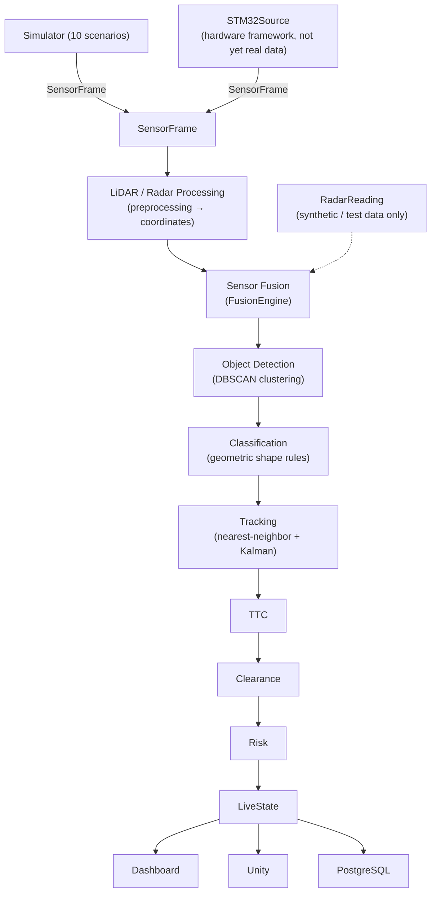
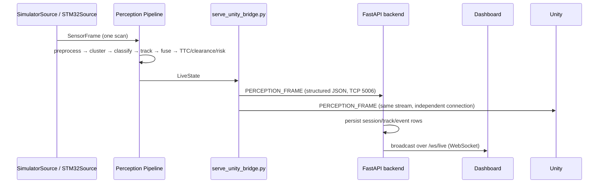

# LiDAR-Vision360

**Real-Time LiDAR–Radar Sensor Fusion and Edge-Based Object Detection, Tracking and Collision Risk
Assessment.**

Full specification: [PROJECT_SPECIFICATION.md](PROJECT_SPECIFICATION.md) (preserved as originally
written; this README tracks actual implementation status, per that document's own instruction).

> **Read this first:** the perception pipeline, tracking, TTC, clearance, risk, the sensor-fusion
> architecture, and the Dashboard/Unity/PostgreSQL flow are all implemented and tested — but
> **against simulation and synthetic data only.** No physical LiDAR, Radar, or STM32 board has
> been connected to this system. See [Current Status](#current-status) and
> [Limitations](#limitations) before assuming otherwise.

---

## Overview

LiDAR-Vision360 turns ~360 `(angle, distance)` measurements from a 2D 360° LiDAR — optionally
fused with radar target reports — into structured environmental understanding: obstacle
detection, classification, persistent tracking, time-to-collision, directional clearance, and an
overall risk assessment. Results are surfaced identically through a Unity digital twin, a
real-time web dashboard, and a PostgreSQL-backed event history.

The system is built **hardware-independent first**: every stage above is developed and validated
against a configurable 2D LiDAR simulator (10 scenarios) before any physical sensor is involved.
A separate, parallel effort has since built the *framework* for real STM32-based hardware input
(serial transport, framing, CRC, sequence validation, reconnection, sensor fusion) — but that
framework has only ever been exercised with synthetic data. This is the central distinction this
README maintains throughout.

## Objectives

Per [PROJECT_SPECIFICATION.md](PROJECT_SPECIFICATION.md) §3 ("Main Objectives"), plus the sensor
fusion work added since:

| Objective | Status |
|---|---|
| Simulated 360° LiDAR data generation | ✅ Implemented (`simulator/`, 10 scenarios) |
| Real LiDAR data integration via hardware adapter | 🔶 Framework implemented (`STM32Source`); real protocol/hardware not yet connected |
| Preprocessing, noise/outlier filtering | ✅ Implemented |
| Polar → Cartesian conversion | ✅ Implemented |
| Obstacle clustering / segmentation | ✅ Implemented (DBSCAN) |
| Geometric feature extraction, shape-based classification | ✅ Implemented |
| Object IDs, tracking, velocity estimation | ✅ Implemented (nearest-neighbor + Kalman filter) |
| Occupancy grid mapping | ✅ Implemented |
| Collision-risk, TTC, low-clearance detection, safety zones | ✅ Implemented |
| Real-time Unity visualization / digital twin | ✅ Implemented |
| Cloud telemetry, real-time dashboard | ✅ Implemented (FastAPI + WebSocket + React) |
| Historical analytics | 🔶 Bounded event/session history in PostgreSQL; no analytics UI beyond the dashboard's own timeline |
| Safety alerts | 🔶 Risk/clearance levels are computed and surfaced; no separate alerting/notification channel |
| Radar integration / sensor fusion | 🔶 `FusionEngine` implemented and tested against synthetic `RadarReading` data; no real R121 data processed |

## Key Features

- Deterministic, geometry-based perception — no deep learning in this prototype.
- One canonical `SensorFrame` abstraction consumed identically whether data comes from the
  simulator or (once configured) real STM32 hardware.
- LiDAR-only and LiDAR+Radar fusion modes, with radar strictly additive: a missing, stale, or
  implausible radar reading always falls back to the exact pre-fusion LiDAR-only behavior.
- Persistent object tracking with stable track IDs across frames, Kalman-filtered velocity.
- Time-to-Collision, directional clearance (front/rear/left/right), and an overall SAFE/WARNING/
  CRITICAL risk level, all recomputed every scan.
- One `LiveState` per scan is the single source of truth streamed to the dashboard, Unity, and
  persisted to PostgreSQL — none of them independently recompute detection/tracking/TTC/clearance/
  risk (see [Edge Computing Pipeline](#edge-computing-pipeline)).
- A hardware-integration framework (serial transport, configurable framing/CRC/sequence
  validation, reconnection, health tracking) ready to receive a real protocol once one exists,
  without guessing any of its actual values.
- 10 reproducible simulation scenarios exercising empty environments, static obstacles, moving
  obstacles, multi-object scenes, narrow corridors, sensor noise, and dropped measurements.

## System Architecture



This is the conceptual data flow. The exact stage order implemented in
`scripts/serve_unity_bridge.py` is: preprocessing → coordinate transform → clustering
(detection) → classification → tracking → **fusion** → collision/TTC + clearance → risk →
`LiveState`. `FusionEngine` runs on the already-tracked LiDAR objects (enriching them with any
matched radar target) rather than before detection — see [Sensor Fusion](#sensor-fusion) and
[docs/fusion.md](docs/fusion.md) for why, and why it makes no difference to what reaches
`LiveState`/Dashboard/Unity/PostgreSQL.

### Important architecture rule

**The Edge processing layer (`perception/`, driven by `scripts/serve_unity_bridge.py`) is the
single source of truth for processed perception results.** The Dashboard and Unity both consume
the identical `LiveState`/`PERCEPTION_FRAME` stream over their own independent connections; neither
independently recomputes detection, classification, tracking, TTC, clearance, or risk. See
[docs/communication.md](docs/communication.md) and [docs/architecture.md](docs/architecture.md).

## Hardware

| Component | Model | Interface | Status in this repository |
|---|---|---|---|
| LiDAR | SLAMTEC RPLIDAR A3M1 | UART → STM32 | Named in the target architecture; no physical unit connected |
| Radar | R121 Radar Module | CAN → STM32 | Named in the target architecture; no physical unit connected; CAN protocol not yet specified |
| ECU | STM32F103C8T6 | UART in (LiDAR), CAN in (Radar), STM32→Edge link out | `datasources.STM32Source` framework implemented; real wire protocol not yet defined |
| Edge computer | Any machine running `perception/` | USB/serial from STM32, when connected | `STM32Source` ready to configure once a real protocol exists |

See [Hardware Integration](#hardware-integration) for exactly what is and is not implemented, and
[docs/hardware-integration.md](docs/hardware-integration.md) for the full parameter checklist.

## Software Stack

| Layer | Technology |
|---|---|
| Perception engine | Python 3.10+, NumPy, scikit-learn (DBSCAN), Pydantic / pydantic-settings |
| Simulator | Python, ray-casting 2D LiDAR model, configurable scenario JSON |
| Hardware transport | `pyserial` (`datasources.stm32.transport.SerialTransport`) |
| Streaming (Edge → consumers) | Raw TCP (legacy `<START>`/`<END>` protocol), structured JSON TCP, over `perception/src/streaming/` |
| Backend | FastAPI, Uvicorn, SQLAlchemy, native WebSockets |
| Database | PostgreSQL, with automatic local SQLite fallback if unreachable |
| Dashboard | React, TypeScript, Vite, Vitest |
| Digital twin | Unity (C#) |
| Testing | pytest (`perception/`, `simulator/`, `cloud/backend/`), Vitest (`cloud/dashboard/`) |

## Data Flow



Unity and the backend are both direct, independent TCP clients of the same bridge process — the
bridge does not relay through the backend, and the backend does not relay through Unity. See
[docs/communication.md](docs/communication.md).

## Edge Computing Pipeline

`scripts/serve_unity_bridge.py` owns the whole pipeline for one run: it selects a `SensorSource`
(`scripts/sensor_source.py`, per `DATA_SOURCE`), then for every scan runs, in order:

1. `preprocessing.Preprocessor` — validation, range filtering, outlier/noise filtering
2. `coordinates.CoordinateTransformer` — polar → Cartesian
3. `clustering.DBSCANClusterer` — obstacle clustering (object detection)
4. `objects.GeometricClassifier` — shape-based classification
5. `tracking.ObjectTracker` — nearest-neighbor association + Kalman filter, persistent track IDs
6. `fusion.FusionEngine` — merges in any available `RadarReading` (see [Sensor Fusion](#sensor-fusion))
7. `collision.CollisionRiskEngine` — TTC, footprint-intersection prediction, risk level
8. `clearance.ClearanceEngine` — directional clearance (front/rear/left/right)
9. `mapping.OccupancyGridMapper` — 2D log-odds occupancy grid (runs in parallel off the Cartesian scan)
10. `pipeline.LiveStateBuilder` — assembles the single `LiveState` for this scan, records events

The resulting `LiveState`/`PERCEPTION_FRAME` is published over the streaming servers
(`perception/src/streaming/`) for Unity and the backend to consume independently.

## SensorFrame Architecture

`SensorFrame` (`perception/src/datasources/base.py`) is a plain alias of `models.scan.ScanFrame` —
not a parallel schema. Every `SensorSource` (`SimulatorSource`, `STM32Source`) implements the same
`connect()` / `disconnect()` / `read_scan() -> SensorFrame` / `is_connected()` interface, so the
rest of the pipeline never knows or cares whether a scan came from the simulator or real hardware.

```python
class LiDARDataSource(ABC):   # == SensorSource
    def connect(self) -> None: ...
    def disconnect(self) -> None: ...
    def read_scan(self) -> ScanFrame: ...   # == SensorFrame
    def is_connected(self) -> bool: ...
```

`scripts/sensor_source.py::get_sensor_source()` is the one composition-root factory that picks
`SimulatorSource` (`data_source="simulation"`) or `STM32Source` (`data_source="hardware"`) — see
[docs/architecture.md](docs/architecture.md) "Sensor source abstraction".

## LiDAR Processing

`preprocessing.Preprocessor` validates each measurement (range, finiteness, sensor-flagged
invalidity), filters isolated-spike outliers and reduces noise over a configurable window, and
optionally applies exponential temporal smoothing. `coordinates.CoordinateTransformer` then
converts every valid polar `(angle, distance)` point to Cartesian `(x, y)`. See
[docs/preprocessing.md](docs/preprocessing.md) and [docs/coordinates.md](docs/coordinates.md).

## Radar Processing

`models/radar.py` defines a protocol-independent `RadarTarget` (`range_m`, and *optionally*
`angle_deg`, `velocity_mps`, `confidence`, `target_id` — populated only when a real parser
actually provides them) and `RadarReading` (a source/session/timestamp-tagged list of targets).
No R121 CAN ID, DLC, byte layout, or scaling factor is referenced anywhere in `models/radar.py`,
`fusion/`, or `datasources/stm32/parsers.py`'s `RadarMessageParser` interface — that mapping does
not exist yet (see [Hardware Integration](#hardware-integration)). `STM32Source` exposes the most
recent parsed reading as `latest_radar_reading`, which stays `None` until a real parser is
supplied.

## Sensor Fusion

`fusion.FusionEngine.fuse(tracked_scan, radar_reading) -> TrackedScan` — same type in, same type
out, so nothing downstream needs to know fusion happened. Implemented behavior:

- **No radar reading available, fusion disabled, a stale timestamp (outside
  `fusion_max_timestamp_diff_s`), or every target failing plausibility checks** → the input
  `TrackedScan` is returned completely untouched (LiDAR-only mode).
- **A radar target spatially and range-gated close enough to a tracked LiDAR object**
  (`fusion_association_max_distance_m` / `fusion_association_max_range_diff_m`, greedy
  nearest-neighbor, one-to-one) → merged into that ONE object (never duplicated): its
  `sensor_sources` gains `"radar"`, `radar_target_id`/`radar_confidence`/`radar_range_m` are
  populated, and its velocity's radial component is replaced by the radar's (typically more
  accurate) range-rate while the LiDAR-derived tangential component is preserved.
- **An unmatched radar target with a resolvable angle** → becomes its own object
  (`classification=UNKNOWN`, no shape data — radar alone provides neither); its track ID is
  stable across frames only if the radar itself reports a stable `target_id`.
- **An unmatched LiDAR object** → passes through untouched.

`FusionEngine` never raises for bad radar input — invalid data is excluded, never allowed to
corrupt the LiDAR-derived result. Full design rationale: [docs/fusion.md](docs/fusion.md).

## Object Detection and Classification

Obstacle clustering (`clustering.DBSCANClusterer`) groups Cartesian points into obstacle clusters,
handling the 0°/360° angular boundary correctly. `objects.GeometricClassifier` then assigns each
cluster a shape class — `WALL`, `VEHICLE_LIKE`, `POLE_LIKE`, `PERSON_LIKE`, `LARGE_OBSTACLE`, or
`UNKNOWN` — from geometric features (aspect ratio, linearity/circularity fit, point density,
angular width), with a human-readable explanation for every classification. This is rule-based
shape classification, not general-purpose object recognition. See
[docs/clustering.md](docs/clustering.md) and
[docs/object-classification.md](docs/object-classification.md).

## Object Tracking

`tracking.ObjectTracker` associates each scan's detections with existing tracks (nearest-neighbor)
and maintains a Kalman filter per track for position/velocity estimation. Tracks move through a
`TENTATIVE → CONFIRMED → COASTING → LOST` lifecycle; every live track keeps a stable `track_id`
across frames until it is lost. See [docs/tracking.md](docs/tracking.md).

## TTC and Clearance

`collision.CollisionRiskEngine` computes Time-to-Collision per object (accounting for the vehicle's
own footprint and motion), whether the object is in the vehicle's projected path, and a predicted
collision time/position. `clearance.ClearanceEngine` independently computes directional clearance
(front/rear/left/right distances, minimum clearance, corridor width) with its own
SAFE/CAUTION/LOW_CLEARANCE/CRITICAL status. See [docs/collision.md](docs/collision.md).

## Collision Risk Assessment

Per-object risk levels (SAFE/WARNING/CRITICAL) combine path membership, distance, TTC, and closing
speed, with hysteresis so a track's reported risk level doesn't flicker across a threshold on
sensor noise alone. An overall scan-level risk is the most severe among all tracked objects. See
[docs/collision.md](docs/collision.md).

## Real-Time Dashboard

`cloud/backend` (FastAPI) ingests the same structured stream Unity consumes, persists
sessions/tracks/events, and serves REST + a `/ws/live` WebSocket. `cloud/dashboard` (React +
TypeScript + Vite) renders system status, live object/track tables, the safety panel (risk,
clearance, TTC), an environment map, and an event timeline — all driven by that one WebSocket feed
plus REST calls, never by recomputing perception itself. See [docs/cloud.md](docs/cloud.md).

## Unity Visualization

`unity/LiDARVision360` is a direct TCP client of the same structured JSON stream the backend
consumes (`PerceptionTCPClient.cs`, port 5006) — it renders the same tracked objects, risk, and
clearance the dashboard shows, not a separately-computed view. See [docs/unity.md](docs/unity.md).

## PostgreSQL

`cloud/backend` persists sessions, track lifecycle records, and collision/clearance/TTC/sensor
events to PostgreSQL via SQLAlchemy. If the configured PostgreSQL instance is unreachable at
startup (e.g. no local server), the backend automatically falls back to a local SQLite file
(`cloud/backend/data/lidar_vision360.db`, gitignored) and logs a warning — this is existing,
intentional local-development behavior, not new to this README update. See
[docs/cloud.md](docs/cloud.md) "Database".

## Simulation Scenarios

All 10 live under `simulator/scenarios/*.json` and are runnable via `python -m simulator.cli` or
the full demo stack. What each one validates:

| Scenario | What it validates |
|---|---|
| `01_empty` | No obstacles anywhere — every ray reports max range; baseline "nothing to detect" behavior. |
| `02_wall_in_front` | A long straight wall 5 m directly ahead — basic detection/classification of a flat surface. |
| `03_pole_left` | A thin pole 3 m to the left — detection/classification of a small, narrow object off-axis. |
| `04_vehicle_ahead` | A car-sized rectangular obstacle 6 m ahead — vehicle-shaped classification and clearance from a compact obstacle. |
| `05_multiple_obstacles` | A wall, a pole, and a vehicle-like rectangle simultaneously — multi-object detection, classification, and independent tracking. |
| `06_narrow_corridor` | Two parallel walls 2.0 m apart (tighter than vehicle width + margin) — directional clearance and low-clearance/critical detection. |
| `07_moving_crossing` | A pole moving laterally at 1.5 m/s across the vehicle's path — tracking a moving, non-head-on object; classification under high relative motion. |
| `08_approaching_obstacle` | A vehicle-like rectangle approaching head-on at 2.0 m/s — TTC decay, clearance/risk escalation (this project's primary collision-risk demo scenario). |
| `09_noisy_lidar` | Scenario 02's geometry with elevated Gaussian distance noise — pipeline robustness to noisy measurements. |
| `10_missing_outliers` | Scenario 02's geometry with elevated missing-measurement and outlier probability — preprocessing's outlier/dropout handling. |

## Project Structure

```
LiDAR-Vision360/
├── perception/                 Python perception engine (installable package, src-layout)
│   ├── src/
│   │   ├── common/             Settings (pydantic-settings), logging
│   │   ├── models/             Canonical data models (LiDARPoint, ScanFrame, DetectedObject,
│   │   │                       TrackedScan, RadarReading, LiveState, ...)
│   │   ├── preprocessing/      Validation, outlier/noise filtering, temporal smoothing
│   │   ├── coordinates/        Polar → Cartesian transformation
│   │   ├── clustering/         DBSCAN obstacle clustering
│   │   ├── objects/            Geometric shape classification
│   │   ├── tracking/           Nearest-neighbor + Kalman filter tracking, track history
│   │   ├── mapping/            2D occupancy grid mapping
│   │   ├── collision/          Collision-risk engine (TTC, prediction, risk)
│   │   ├── clearance/          Directional clearance engine
│   │   ├── fusion/             Sensor fusion (FusionEngine, association, validation)
│   │   ├── datasources/        SensorSource abstraction, SimulatedLiDARDataSource,
│   │   │   └── stm32/          STM32Source + hardware framework (transport, connection
│   │   │                       manager, framing, CRC, sequence validation, health, parsers)
│   │   ├── pipeline/           LiveState assembly
│   │   ├── serialization/      Unity/dashboard wire-format message builders
│   │   └── streaming/          TCP servers (raw + structured JSON), bounded outgoing queues
│   └── tests/                  863 tests (pytest)
├── simulator/                  Configurable 2D 360° LiDAR simulator
│   ├── scenarios/               10 predefined scenario JSON files
│   ├── src/simulator/          Ray-casting model, obstacles, noise, CLI, recording/replay
│   └── tests/                  228 tests
├── cloud/
│   ├── backend/                 FastAPI backend (REST + WebSocket + PostgreSQL/SQLite)
│   │   └── src/backend/routes/ core.py, debug.py, events.py, frames.py, metrics.py
│   └── dashboard/               React + TypeScript + Vite dashboard
├── unity/LiDARVision360/        Unity digital twin project
├── embedded/stm32/              STM32 firmware placeholder (not implemented; awaiting protocol spec)
├── docker/                      Containerization (README only; no Dockerfile yet)
├── docs/                        Per-subsystem architecture/design docs
├── scripts/                     Setup, demo launch/stop, benchmarks, visualizers, verification
├── PROJECT_SPECIFICATION.md     Canonical original specification
└── README.md                    This file
```

## Installation

Requires Python 3.10+ and Node.js (for the dashboard). Commands below are what this repository's
own `scripts/setup_env.ps1` / `scripts/setup_env.sh` run, plus the backend/dashboard steps those
scripts don't currently cover.

**1. Python environment:**

```bash
python -m venv .venv
```
```bash
# Windows PowerShell
.venv\Scripts\Activate.ps1
# macOS/Linux
source .venv/bin/activate
```

**2. Perception + simulator (editable, with test dependencies):**

```bash
pip install -e "./perception[dev]"
pip install -e "./simulator[dev,viz]"
```

**3. Cloud backend** (not installed by `setup_env.*` — install it the same way):

```bash
pip install -e "./cloud/backend[dev]"
```

**4. Dashboard (frontend) dependencies:**

```bash
cd cloud/dashboard
npm install
```

**5. Environment file** (optional — every setting has a working default):

```bash
cp .env.example .env
```

`scripts/setup_env.ps1` (Windows) / `scripts/setup_env.sh` (macOS/Linux) automate steps 1-2 and 5.

## Configuration

All settings are environment variables prefixed `LIDAR_`, read by
`perception/src/common/config.py` (pydantic-settings) — `cloud/backend` reuses the same `Settings`
class. See [.env.example](.env.example) for the full, documented list. Key groups:

| Group | Examples |
|---|---|
| LiDAR / vehicle | `LIDAR_LIDAR_RANGE_MAX_M`, `LIDAR_VEHICLE_WIDTH_M`, `LIDAR_VEHICLE_LENGTH_M` |
| Backend / database | `LIDAR_BACKEND_PORT`, `LIDAR_DATABASE_URL` |
| Sensor source selection | `LIDAR_DATA_SOURCE=simulation` \| `hardware` |
| STM32 hardware protocol | `LIDAR_STM32_UART_PORT`, `LIDAR_STM32_UART_BAUDRATE`, plus framing/byte-order/CRC/message-type/scaling/timestamp fields — all unset by default; see [Hardware Integration](#hardware-integration) |
| Sensor fusion | `fusion_enabled`, `fusion_association_max_distance_m`, `fusion_association_max_range_diff_m`, `fusion_max_timestamp_diff_s`, `fusion_max_valid_range_m`, `fusion_max_valid_velocity_mps` (defined in `common/config.py`; not yet mirrored in `.env.example`) |

`LIDAR_DATA_SOURCE=hardware` selects `STM32Source`, but its `connect()` deliberately raises
`STM32ConfigurationError` until every required protocol field above is set to a real value from
the hardware team's specification — it never falls back to simulated data.

## Running the Project

One command starts the whole simulation stack (perception bridge + FastAPI backend + React
dashboard), each in its own window, with process-identity-based startup/shutdown and end-to-end
verification:

```powershell
.\scripts\run_demo.ps1 -Scenario 08_approaching_obstacle -Rate 10
```

Then open `http://localhost:5173`. Unity connects to the same `127.0.0.1:5006` independently (open
`unity/LiDARVision360` in the Editor, set `LidarInputManager.mode = StructuredJsonTcp`, press
Play).

```powershell
.\scripts\stop_demo.ps1
```

To run each piece by hand instead (three terminals):

```powershell
python scripts/serve_unity_bridge.py --scenario 08_approaching_obstacle --vehicle-speed 0 --rate 10
```
```powershell
uvicorn backend.main:app --app-dir cloud/backend/src --host 0.0.0.0 --port 8000
```
```powershell
cd cloud/dashboard; npm run dev
```

**Hardware mode** — currently supported only as a launch mode, not a validated data path (see
[Hardware Integration](#hardware-integration)):

```powershell
$env:LIDAR_DATA_SOURCE = "hardware"
python scripts/serve_unity_bridge.py
```

This will fail fast with `STM32ConfigurationError: STM32 protocol configuration incomplete: ...`
until the hardware protocol fields in `.env` are filled in from a real specification — by design,
it never silently substitutes simulated data.

## Running Individual Scenarios

```powershell
.\scripts\run_demo.ps1 -Scenario 01_empty
```
```powershell
.\scripts\run_demo.ps1 -Scenario 05_multiple_obstacles
```
```powershell
.\scripts\run_demo.ps1 -Scenario 08_approaching_obstacle -Rate 10
```

Or directly against the simulator, without the backend/dashboard:

```powershell
python -m simulator.cli list
python -m simulator.cli run --scenario 05_multiple_obstacles --scans 5
```

## Debugging Endpoints

Served by `cloud/backend`, at both a bare path and an `/api/`-prefixed path (e.g. `/health` and
`/api/health` are the same endpoint):

| Endpoint | Purpose |
|---|---|
| `GET /health` | Backend liveness/uptime. |
| `GET /status` | Connection state to the perception bridge, session info, measured scan rate. |
| `GET /debug/live-frame` | The current live perception frame (objects, tracks, risk, clearance) — `null` if not connected. |
| `GET /debug/stream-status` | Denser single-call summary: connected, frame age, risk, object/track counts, latency. |
| `GET /latest`, `/objects`, `/tracks`, `/tracks/{track_id}` | Current-scan snapshots. |
| `GET /events`, `/collision-events`, `/clearance-events`, `/ttc-events`, `/sensor-events` | DB-persisted event history, session-scoped by default. |
| `GET /sessions`, `/sessions/{id}` | Session records. |
| `GET /metrics` | Backend metrics. |
| `WS /ws/live` | Real-time WebSocket feed the dashboard consumes. |

## Testing

```bash
pytest perception/tests -q
pytest simulator/tests -q
pytest cloud/backend/tests -q
```
```bash
cd cloud/dashboard
npm test
```

Verified results (this repository, run against simulation/synthetic data only — **not** hardware
validation):

| Suite | Result |
|---|---|
| `perception/tests` (863 tests total) | **863 passed** |
| — of which, hardware-adapter framework tests (`test_stm32_*.py`, synthetic byte packets/fake transports) | **90 passed** |
| — of which, sensor-fusion tests (`test_fusion_*.py`, synthetic `RadarReading` objects) | **39 passed** |
| `simulator/tests` (228 tests) | **228 passed** |
| `cloud/dashboard` (Vitest) | **34 passed** |
| `cloud/backend/tests` (80 tests total) | `test_ingestion.py` (12) and `test_state.py` (28) pass; `test_api.py` (40) currently hangs when run under `pytest` in this environment — a known, separately-tracked issue unrelated to hardware/fusion work |

## Hardware Integration

**Implemented (software/hardware framework):**

- `datasources.STM32Source` — the `SensorSource` selected by `DATA_SOURCE=hardware`
- `datasources.stm32.transport.SerialTransport` — real serial I/O via `pyserial`
- `datasources.stm32.connection_manager.STM32ConnectionManager` — connect/reconnect with
  exponential backoff
- `datasources.stm32.framing.FrameCodec` — configurable delimited or fixed-length framing
- `datasources.stm32.crc` — selectable checksum algorithms (`none`, `xor8`, `sum8`, `crc8`,
  `crc16_ccitt`)
- `datasources.stm32.sequence.SequenceValidator` — dropped-frame / duplicate detection, optional
  wraparound handling
- `datasources.stm32.health.HealthMonitor` — per-channel (LiDAR/radar) connection/health tracking
- `datasources.stm32.parsers` — `LiDARMessageParser`/`RadarMessageParser` interfaces; the shipped
  default implementations always raise `STM32ConfigurationError` rather than guess a payload
  layout
- `fusion.FusionEngine` — consumes `STM32Source.latest_radar_reading` when present

**Pending real hardware validation** (see [docs/hardware-integration.md](docs/hardware-integration.md)
for the full checklist):

- Actual A3M1 → STM32 UART data
- Actual R121 → STM32 CAN data
- Actual STM32 → Edge communication (transport, framing, CRC, message layout, scaling, timestamp
  format are all still unset placeholders — `.env.example`)
- Any real physical sensor measurement flowing through this system
- Real-world LiDAR/Radar fusion
- Hardware-in-the-loop validation of any kind

No COM port, baud rate, CAN ID, CAN bitrate, packet format, CRC parameter, or sensor measurement
in this repository is invented — every hardware-specific value is either a documented placeholder
or absent pending the real specification.

## Current Status

Software perception and simulation validation are implemented: the full pipeline (preprocessing
through risk assessment), sensor-fusion architecture, Dashboard, Unity, and PostgreSQL persistence
all work end-to-end against the 10 simulation scenarios and synthetic radar data, with 863 + 228 +
34 automated tests passing (see [Testing](#testing)). The hardware integration layer
(`STM32Source` and its supporting framework) is implemented and unit-tested against synthetic byte
packets, and is prepared to accept real STM32-based sensor input. **Physical A3M1/R121 validation
remains pending final hardware communication specifications and connection to the physical sensor
setup** — nothing in this repository has processed a real hardware measurement.

One known, pre-existing, unrelated issue: `cloud/backend/tests/test_api.py` hangs under `pytest`
in this environment (see [Testing](#testing)) — flagged separately, not blocking simulation-mode
operation (`run_demo.ps1`'s own end-to-end verification against the live backend passes).

## Limitations

- 2D LiDAR only — no true 3D reconstruction; Unity's 3D view is a visualization of 2D-derived data.
- Sensor fusion is architecture-and-interface complete but has never processed a real radar
  reading — all fusion test coverage uses synthetic `RadarReading`/`RadarTarget` objects.
- `STM32Source` cannot connect without a complete, real protocol specification — by design, not a
  bug.
- Radar-only fused objects (no LiDAR match) carry no shape/size information — radar alone cannot
  provide it.
- No production deployment, authentication, or historical-analytics UI beyond the dashboard's own
  bounded event timeline.
- `cloud/backend/tests/test_api.py` currently hangs in this environment (see
  [Current Status](#current-status)).

## Future Work

- Obtain and implement the real R121 CAN protocol and STM32→Edge wire protocol (see
  [docs/hardware-integration.md](docs/hardware-integration.md)'s checklist).
- Perform actual hardware-in-the-loop validation once physical sensors are connected.
- Tune fusion association/gating thresholds against real R121 accuracy characteristics.
- Historical analytics beyond the current bounded event log; configurable alerting.
- Production cloud deployment and authentication.

## Contributors

See repository commit history.
